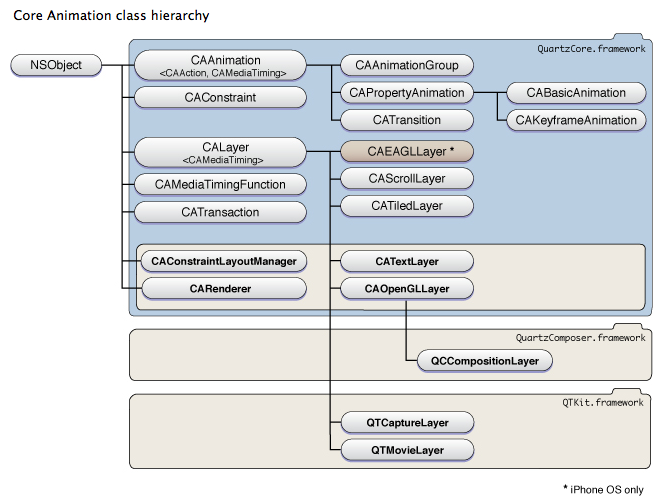

#iOS动画(一)UIKit Animation
在iOS中动画主要是由Core Animation实现，下图是Core Animation的层次结构。

##Core Animation的基础：CALayer
其中最基础的提供显示内容的图层类是CALayer，也就是我们在UIKit中经常调用调整控件的`view.layer`。由于CALayer最早是应用于OS X平台，有很多特性不适合移动端开发，因此为移动端进行封装，由此产生了UIView。UIView只是在CALayer上的封装，简化了CALayer的绘图动画功能，添加了事件处理的功能。
##UIView动画
通过调用底层的Core Animation基本上可以绘制任何自定义的动画，不过正因为其强大导致底层API过于复杂。而UIView中对其进行了简化封装，只需要几个简单的函数就可以实现大多数情况的效果。当然如果需要实现更加细腻动态的效果最好使用Core Animation实现。

UIKit中实现的动画只能通过UIView单例来实现。
###animateWithDuration
通过设定动画持续时间和动画效果来产生动画的函数共有4个

```swift
animateWithDuration(_:animations:)
animateWithDuration(_:animations:completion:)
animateWithDuration(_:delay:options:animations:completion:)
animateWithDuration(_:delay:usingSpringWithDamping:initialSpringVelocity:options:animations:completion:)
```
其中每个参数的含义：

+ _：动画持续的时间
+ delay：动画的延迟时间
+ options：一些可选的动画效果，包括重复，动画速度曲线
+ usingSpringWithDamping：弹簧动画的阻尼值，取值范围0.0~1.0，阻尼越小弹动幅度越大
+ initialSprintVelocity：弹簧动画的动力，如果值为0则忽略该属性，通过动画时间和阻尼来绘制动画
+ animations：执行动画的内容，包括移动，缩放等效果
+ completion：动画结束后执行的操作

###transition
转场动画的函数共有2个，这两个函数最好用于视图转换而不要应用在控件上。

```swift
transitionWithView(_:duration:options:animations:completion:)
transitionFromView(_:toView:duration:options:completion:)
```
每个参数的含义：

+ _：改变的视图
+ toView：转变后的视图
+ duration：动画时间
+ options：动画效果
+ animations：动画内容
+ completion：结束后执行的操作

###UIViewAnimationOptions
作为在动画函数中options的参数，UIViewAnimationOptions中定义了许多动画选项(尽管很多选项之间毫无关系)

用户行为：

+ AllowUserInteraction：允许用户交互，比如点击

动画行为：

+ Repeat：动画无限重复
+ Autoreverse：在下一周期动画反向播放，需要先设置Repeat
+ LayoutSubviews：子视图与父视图一起进行动画
+ BeginFromCurrentState：从当前状态开始播放
+ OverrideInheritedDuration：忽略外层动画嵌套的执行时间
+ OverrideInheritedCurve：忽略外层动画嵌套的时间变化曲线
+ AllowAnimatedContent：通过改变属性和重绘实现动画效果，如果key没有提交动画将使用快照
+ ShowHideTransitionViews：用显隐的方式替代添加移除图层的动画效果
+ OverrideInheritedOptions：忽略嵌套继承的选项

时间函数：

+ CurveEaseInOut：由慢到快到慢
+ CurveEaseIn：由慢到快
+ CurveEaseOut：又快到慢
+ CurveLinear：线性(匀速)

转场动画：

+ TransitionNone：无转场动画
+ TransitionFlipFromLeft：转场从左翻转
+ TransitionFlipFromRight：转场从右翻转
+ TransitionCurlUp：上卷转场
+ TransitionCurlDown：下卷转场
+ TransitionCrossDissolve：转场交叉消失
+ TransitionFlipFromTop：转场从上翻转
+ TransitionFlipFromBottom：转场从下翻转